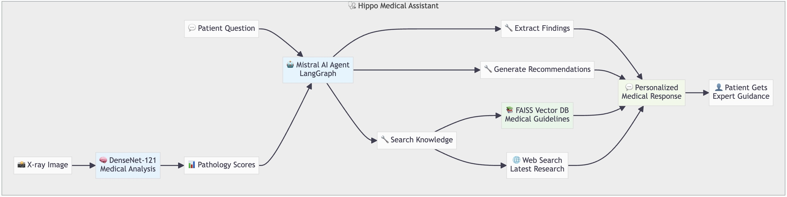

# Hippo - AI Medical Assistant with Agentic Workflow

**Intelligent medical assistant powered by Mistral models and LangGraph agentic workflow, combining computer vision (DenseNet-121) with hybrid RAG knowledge retrieval for personalized X-ray interpretation and patient guidance.**

🏆 **3rd Place Winner** - AI for Good Hackathon 2024 at EPFL (Guillaume Krafft, Theo Gieruc, Axel Collet, Patrick Remerscheid)

## 🎯 Vision: Democratizing Medical Imaging Access

Automated, non-clinician imaging centers for cost-effective cancer screening and prevention - making quality medical imaging as accessible as getting a haircut.

## 🚀 Demo


1. **🏥 Technician Interface** - Patient gets scanned, technician manages results distribution, DenseNet-121 provides instant X-ray analysis
2. **👤 Patient Interface** - Patient reviews results and chats with HippoChat AI assistant using personal context, expert guidelines and web search
3. **🛠️ Development Environment** - Complete workflow testing and debugging in LangGraph Studio


## 🏗️ Agentic Workflow & Technical Stack



**Core Innovation**: LangGraph orchestrates intelligent tool selection, combining medical-grade computer vision with hybrid knowledge retrieval for evidence-based patient care.

### Technical Components
- **🧠 Agent**: LangGraph + Mistral-large-latest
- **🔍 Computer Vision**: torchxrayvision DenseNet-121
- **📚 Knowledge**: FAISS vector store + Tavily web search
- **🛠️ Tools**: 4 specialized medical functions
- **💾 State**: Efficient runtime context management

### Core Agentic Tools
1. `extract_top_findings` - X-ray pathology analysis
2. `retrieve_medical_knowledge` - Hybrid knowledge search
3. `generate_recommendations` - Evidence-based care guidance
4. `get_patient_information` - Personalized demographics


## 🎮 Running the Application

### Prerequisites
- Install [uv](https://docs.astral.sh/uv/) package manager
- **📋 See [CONFIGURATION.md](CONFIGURATION.md) for complete setup guide and all required API keys**

### Option 1: Gradio Frontend (Complete User Experience)
```bash
uv run gradio_frontend.py
```
**Access at**: `http://localhost:7860`
- **Technician Interface**: Upload & analyze X-ray images
- **Patient Interface**: Interactive AI guidance and Q&A

### Option 2: LangGraph Studio (Development & Testing)
```bash
uv run start_langgraph.py
```
**Access at**: `http://127.0.0.1:2024`
- Interactive agent testing with debugging tools
- Real-time conversation tracing
- Hot reload for development

#### 🧪 Example LangGraph Studio Test

**Try this prompt to see hybrid retrieval in action:**
```
Can you tell me about the latest research and current treatment protocols for pneumothorax? I want both expert guidelines and recent developments.
```

**With X-ray results:**
```json
{
    "Cardiomegaly": 0.85,
    "Pneumonia": 0.72,
    "Pleural_Effusion": 0.68,
    "Normal": 0.15,
    "Pneumothorax": 0.12
}
```

**Patient context:**
```json
{"name": "Test Patient", "age": 45}
```

This will trigger both local FAISS search (expert guidelines) and web search (latest research), demonstrating the intelligent hybrid retrieval system.


## 🧪 Testing & Validation

### Run Agent Tests
```bash
# Test complete X-ray interpretation workflow
uv run python tests/test_medical_agent.py

# Compare LLM vs LLM+RAG performance
uv run python tests/test_rag_comparison.py
```

### Key Test Scenarios
- **X-ray Analysis**: Automated pathology detection and interpretation
- **Medical Q&A**: Patient questions with contextual responses  
- **RAG Effectiveness**: Knowledge retrieval quality assessment
- **Tool Orchestration**: LangGraph agent decision-making


## 🌟 Vision: Transforming Healthcare Access


### Midterm Vision: Accessible Medical Imaging
**"Getting a medical scan as easy as getting a haircut"**

Imagine routine cancer screening at a local imaging center within 40 minutes from your home:

1. **Walk in** → Get scanner assigned instantly
2. **Minimal prep** → Technical operator handles basic safety protocols  
3. **Get scanned** → Automated imaging process
4. **Walk out** → Complete in ~45 minutes

**Instant results**: Receive your diagnosis and follow-up steps via phone, delivered by Hippo in clear, personal language. Your results integrate with your complete medical history for comprehensive care recommendations and daily lifestyle guidance.


### Validation & Safety Considerations
Critical questions remain: Is more screening truly beneficial? How do we ensure AI accuracy? Our approach leverages the fact that >90% of screenings should be negative - we can deploy AI systems with high false-positive rates in the beginning, flagged for expert human review. As experts provide feedback on these cases (who would be seen regardless), the system gradually becomes less conservative through continuous learning, ultimately reducing hospital overcrowding while increasing access to quality screening.

### Long-term Vision: Continuous Health Monitoring
**"24/7 awareness of your body's physical and mental state"**

Future possibilities: Wearable scanners, home-based imaging, continuous biometric integration. Can we create privacy-preserving agents that track and optimize your entire health journey in real-time?